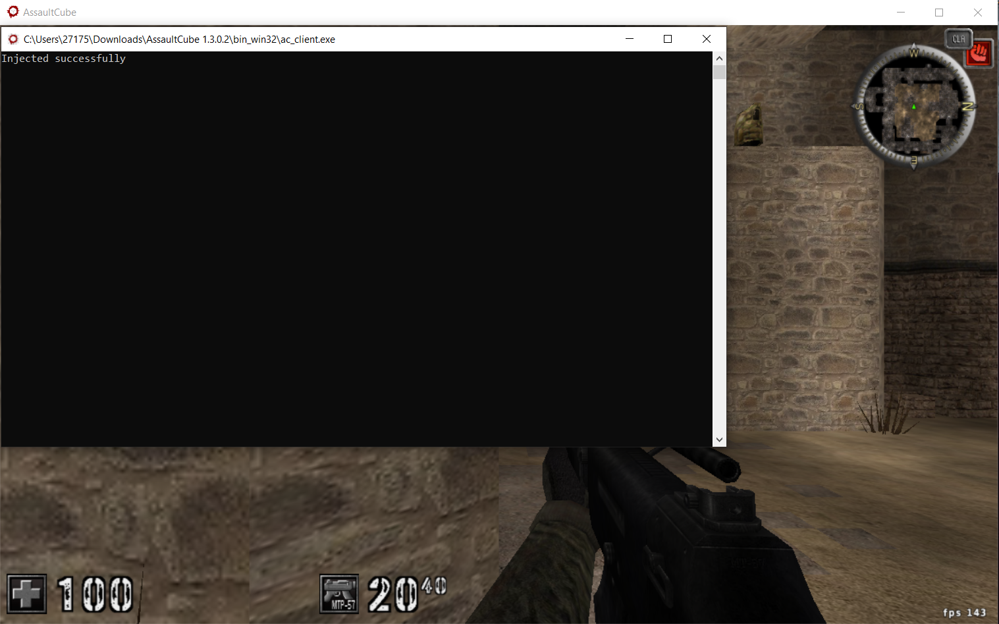

# AssultCube-Hack
This project is intended for educational purposes, specifically focusing on learning C++ programming and exploring the fundamentals of game hacking.

# Version 1
Features: Console Dll  
Learning Objective: Dll Thread creation  

# Version 2
Features: Menu  
Learning Objective: Function hooking, and rendering  

# Version 3
Features: Save/Load/Delete Profile configs  
Learning Objective: Saving & Loading States in json  

# Version 4
Features: Map & Radar Hack  
Learning Objective: Assembly Code Patching  

# Version 5
Features: NoClip & Weapon Stats  
Learning Objective: Reverse Engineering  

